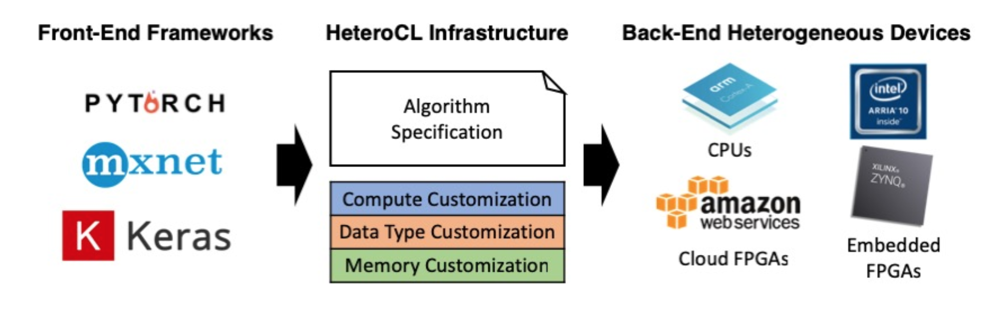

# OpenCL_Xilinx-Intel_HeteroCL
This is a repo which contains something about how to use OpenCL backend (Xilinx/Intel) to test the samples in HeteroCL (Not just testing).

## HeteroCL(FPGA'19 Best Paper Award!)

If you do not know HeteroCL, you can figure it out through this [link](https://github.com/cornell-zhang/heterocl). It is an open source project developed by [Computer Systems Lab, Zhang-Group](http://heterocl.csl.cornell.edu/web/)

---

## Introduction

- I add the OpenCL backend for HeteroCL ( Xilinx & Intel ), which can be found in this [branch](https://github.com/ybai62868/heterocl/tree/opencl).

- If you want to use HeteroCL to generate Vivado HLS C++ code and then wrapper it into the OpenCL host file run on the AWS, you can use this [branch](https://github.com/ybai62868/heterocl/tree/aws).

### Major features 

- [x] Loop Unrolling
- [x] Loop Piplining 
- [x] Pratition for Xilinx
- [x] Arbitrary Precision Integers for Intel
- [x] Runtime System:
  - [x] OpenCL C API for Intel (AOCL)
  - [x] OpenCL C++ Wrapper API for Xilinx (SDAccel)
  - [x] Rosetta for AWS

## Updates

## Installation 

Please refer to [INSTALL.md](docs/INSTALL.md) for installation and environment preparation.

## Get Started

Please see [GETTING_STARTED.md](docs/GETTING_STARTED.md) for the basic usage of HeteroCL OpenCL backend.

## Technical Report

Please see  [TECHNICAL_DETAILS.md](docs/TECHNICAL_DETAILS.md) for learning how to add FPGA backend (Code Generation and Runtime) for HeteroCL.

---

## Acknowledgement

This work had been done when I was an Intern at Cornell University (Computer Systems Lab).

